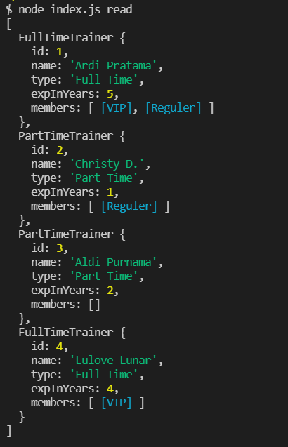
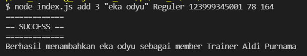
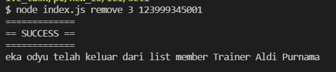
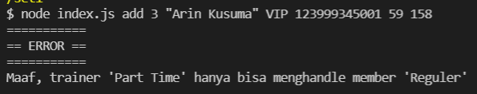
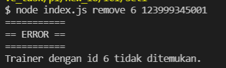
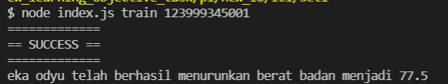
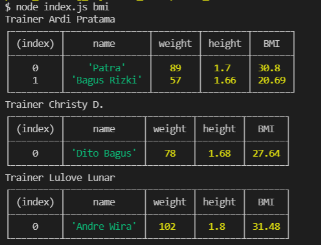

# Hacktiv Gym

> ⏰ Duration 120 minutes  
> 09.20 - 11.20 WIB

## Summary

Kalian diminta untuk membuat sebuah aplikasi bernama `Hacktiv Gym` yang akan membantu para `Trainer` mendata dan melatih `Member Gym`.

> Dalam pengerjaannya menggunakan MVC dan Callback (fs.readFile dan fs.writeFile)

## Release 0

Buatlah class `Trainer` yang memiliki property :

| Property      | Description                                               |
| ------------- | --------------------------------------------------------- |
| id            | id dari `Trainer`                                         |
| name          | nama dari `Trainer`                                       |
| type          | tipe dari `Trainer`                                       |
| expInYears    | lama pengalaman yang dimiliki oleh `Trainer` dalam tahun  |
| members       | kumpulan instance dari class `Member`                     |

dimana class `Trainer` terbagi menjadi 2 berdasarkan tipe nya :
1. `FullTimeTrainer` => `Full Time`
2. `PartTimeTrainer` => `Part Time`

Lalu, buatlah class `Member` dengan property sebagai berikut :

| Property      | Description                                               |
| ------------- | --------------------------------------------------------- |
| name          | nama milik `Member`                                       |
| type          | tipe `Member` pada gym                                    |
| id_card       | (private) nomor ktp `Member`                              |
| weight        | berat `Member` dalam satuan kilogram                      |
| height        | tinggi `Member` dalam satuan meter                        |

dimana class `Member` juga terbagi menjadi 2 berdasarkan tipe nya :
1. `VIP` => `VIP`
2. `Reguler` => `Reguler`

> gunakan factory method untuk membuat instance

<hr>

## Release 1

> `FORMAT DATA PADA "data.json" TIDAK BOLEH DIUBAH` (keyname-nya) 
> Perlu diingat bahwa private property tidak dapat dibaca oleh JSON stringify sehingga kamu perlu melakukan adjusment

1. Buatlah fitur untuk menampilkan seluruh `Trainer` bersamaan dengan `Member` yang terdapat pada property 

    

2. Buatlah fitur untuk menambahkan member kepada trainer tertentu dengan command sebagai berikut :

    ```bash
    $ node index.js add <id_trainer> <nama> <tipe> <ktp> <berat> <tinggi>
    ```

    Contoh commandnya adalah sebagai berikut:

    ```bash
    $ node index.js add 3 "eka odyu" Reguler 123999345001 78 164
    ```

    

3. Buatlah fitur untuk mengeluarkan member dari list trainer tertentu berdasarkan id trainer dan nomor ktp member tersebut dengan command :

    ```bash
    $ node index.js remove <id_trainer> <ktp>
    ```

    Contoh commandnya adalah sebagai berikut:

    ```bash
    $ node index.js remove 3 123999345001
    ```

    

<hr>

## Release 2

1. Buatlah validasi agar member bertipe VIP hanya boleh di dilatih oleh trainer full time dan tampilkan pesan error tidak sesuai.

    Contoh pesan error sebagai berikut:

    ```bash
    $ node index.js add 3 "Arin Kusuma" VIP 123999345001 59 158
    ```

    

2. Buatlah validasi jika menambahkan/mengeluarkan member kepada trainer yang tidak ada

    Contoh pesan error sebagai berikut:

    ```bash
    $ node index.js remove 6 123999345001
    ```

    

<hr>

## Release 3

1. Buatlah sebuah instance method dengan nama `train` pada class `Member`. Method `train` akan menurunkan berat sebanyak `0.5 kg`, namun member `VIP` akan menurunkan berat sebanyak `1 kg` (karena bantuan alat mewah).

2. Buatlah fitur untuk melatih member dan tampilkan berat badan terbarunya dengan command berikut :

    ```bash
    $ node index.js train <ktp>
    ```

    Contoh commandnya adalah sebagai berikut:

    ```bash
    $ node index.js train 123999345001
    ```

    

<hr>

## Release 4

1. Buatlah sebuah instance method dengan nama BMICalculation yang akan mengembalikan hitungan BMI (Body Mass Index) dengan rumus berat/tinggi*tinggi

    ```txt
    Sebaiknya, instance method BMICalculation diletakkan pada class apa?
    ```

2. Buatlah fitur untuk menampilkan BMI setiap member yang di list berdasarkan trainernya (hanya trainer yang memiliki member) dalam bentuk table (manfaatkan console.table)

    Contoh commandnya adalah sebagai berikut:

    ```bash
    $ node index.js bmi
    ```

    